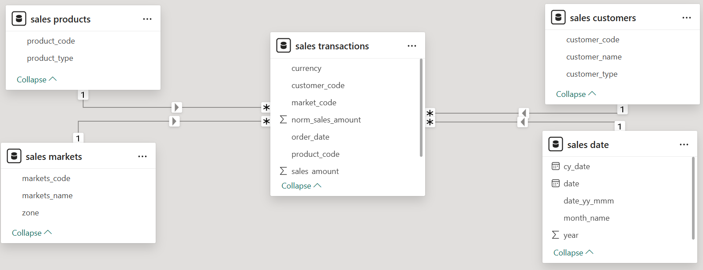
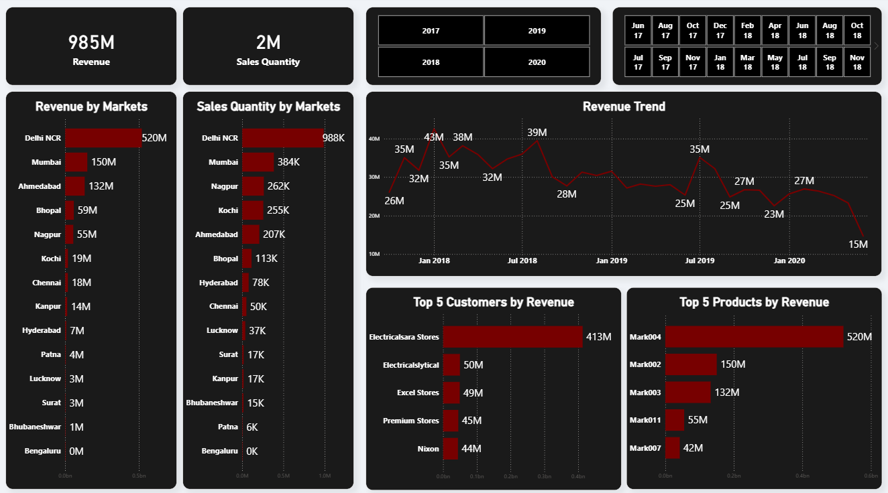

# 🚀 Sales Insights Data Analysis | (AtliQ Hardware)

## 📌 Project Overview

This project analyzes sales data from **AtliQ Hardware**, a company specializing in computer hardware and peripherals across India.

The objective is to transform raw sales data into actionable business insights through an interactive **Power BI dashboard**, enabling stakeholders to monitor key performance indicators, identify trends, and make data-driven decisions.

---

## ❗ Problem Statement

The Sales Director faced several business challenges:

- No centralized dashboard to monitor sales performance
- Reliance on verbal updates from regional managers
- Declining sales without clear visibility into the root cause

**Solution:** A centralized and interactive Power BI dashboard that provides a single source of truth for business performance.

---

## 🎯 Objectives

- Analyze sales trends across different markets
- Identify top-performing customers and products
- Track revenue and sales quantity over time
- Enable faster and informed business decisions

---

## 🛠️ Tools & Technologies

| Tool | Purpose |
|----------------|--------------------------------|
| **SQL (MySQL)** | Data extraction & analysis |
| **Power BI** | Dashboard development & visualization |
| **Power Query** | Data cleaning & transformation |
| **DAX** | KPI calculations & business metrics |

---

## 📂 Dataset Information

The project uses the following tables:

- **sales_transactions** – Transaction details
- **sales_customers** – Customer information
- **sales_products** – Product information
- **sales_markets** – Market/region details
- **sales_date** – Date hierarchy

---

## 🔄 Data Cleaning & Transformation

- Removed invalid (zero or negative) sales values
- Converted USD transactions into INR
- Removed duplicate and irrelevant records
- Standardized data formats
- Built a star schema for efficient reporting

---

## 📊 Data Modeling

The data model establishes relationships between:

- Transactions → Customers
- Transactions → Products
- Transactions → Markets
- Transactions → Date

This star schema improves query performance and enables scalable business analysis.

---

## 📌 Data Model

---

## 📈 Dashboard Features

### 📊 Key Performance Indicators (KPIs)

- 💰 Total Revenue: **₹985M**
- 📦 Total Sales Quantity: **2M**

### 📉 Visualizations

- Revenue by Market
- Sales Quantity by Market
- Revenue Trend Analysis
- Top 5 Customers by Revenue
- Top 5 Products by Revenue

### 🎛️ Interactive Filters

- Year Slicer
- Month Slicer

---

## 📌 Dashboard Preview

---

## 🔍 Key Insights

- Delhi NCR generates the highest revenue.
- Low-performing markets were identified for improvement.
- A small number of customers and products contribute the majority of total revenue (Pareto Principle).
- Revenue trends reveal seasonal business patterns.

---

## 📊 DAX Measures Used

- **Revenue** = `SUM(sales_amount)`
- **Sales Quantity** = `SUM(sales_qty)`
- **Revenue LY (Last Year Comparison)**
- **Profit Margin %**
- **Revenue Contribution %**

---

## 💡 Business Impact

- Reduces manual reporting efforts
- Provides real-time business insights
- Identifies growth opportunities across markets
- Enables faster, data-driven decision-making

---

## 🚀 Skills Demonstrated

- SQL Querying
- Data Cleaning & Transformation
- Data Modeling
- ETL Process
- Power Query
- DAX Calculations
- Dashboard Development
- Business Intelligence
- Data Visualization

---

## 📁 Project Files

| File | Description |
|-------------------------------|--------------------------------|
| **Atliq_Hardware_Sales_Data_Analysis.pbix** | Power BI dashboard |
| **README.md** | Project documentation |
| **dashboard.png** | Dashboard preview image |
| **data-model.png** | Data model diagram |

---

## ⭐ Conclusion

This project demonstrates an end-to-end Business Intelligence workflow using **SQL, Power BI, Power Query, and DAX**. It showcases how raw sales data can be transformed into meaningful insights that help stakeholders monitor performance, identify trends, and make informed business decisions.

---

## 🙌 Support

If you found this project helpful or learned something from it, consider giving this repository a ⭐ on GitHub
